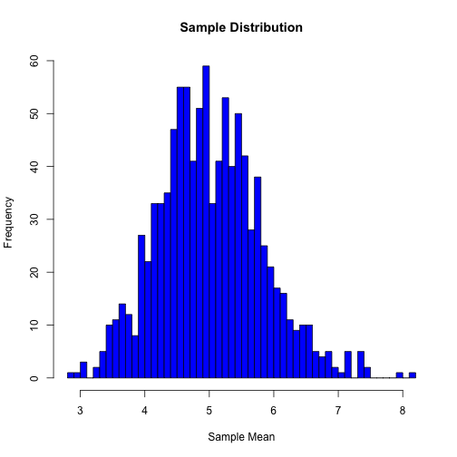
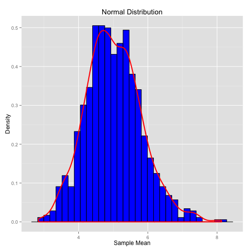

# Overview

In this report we will investigate the exponential distribution in R and compare it to the Central Limit Theorem. We will simulate the exponential distribution in R with rexp(n, lambda) where lambda is the rate parameter. For our simulations we will set lambda = 0.2, do a thousand simulations and will investigate the distribution of averages of 40 exponentials. The mean and standard deviation of the exponential distribution are both 1/lambda.


# Simulations

The following code runs 1000 simulations. The sample size is set to 40 and lambda is set to 0.2. We set the seed so that this report can be reproducible. Setting the seed allows somebody checking this report to get the exact same data as is in this report. Next we run the simulations and find the mean.

```r
library(ggplot2)
lambda <- 0.2
number_simulations <- 1000
sample_size <- 40
set.seed(2015)
run_simulation <- matrix(rexp(number_simulations*sample_size, rate=lambda), number_simulations, sample_size)
sample_mean <- rowMeans(run_simulation)
```

After we run the simulations and find the mean, we plot a histogram of the data found in the simulations. This step is shown in the following code.


```r
hist(sample_mean, breaks=40, col="blue", main= "Sample Distribution", xlab = "Sample Mean")
```

 
  
# Sample Mean Versus Theoretical Mean

### Sample Mean and Theoretical Mean

```r
s_mean       <-      mean(sample_mean)
s_mean
```

```
## [1] 5.011563
```

```r
theoretical_mean  <-     1/lambda
theoretical_mean
```

```
## [1] 5
```


We can see that after running the simulations and calculating the theoretical mean, that these two numbers are very close. This implies that this sample is a good estimation of the population. It also shows that this distribution is approximately a normal distribution.

# Sample Variance Versus Theoretical Variance

### Sample Variance and Theoretical Variance

```r
standard_dev_sample   <-    sd(sample_mean)
standard_dev_sample
```

```
## [1] 0.8006739
```

```r
variance_sample       <-    var(sample_mean)
variance_sample
```

```
## [1] 0.6410788
```

```r
theory_sd             <-    1/lambda/sqrt(sample_size)
theory_sd
```

```
## [1] 0.7905694
```

```r
theory_variance       <-    theory_sd^2
theory_variance
```

```
## [1] 0.625
```


We also see that the sample variance and standard deviation are close to the theoretical variance and standard deviation. Therefore the sample variance is a good estimation of the population variance. Once again we also see that this distribution is approximately a normal distribution.

# Distribution

```r
mean_graph <-  data.frame(sample_mean)
ggplot(mean_graph, aes(x=sample_mean)) + geom_histogram(aes(y=..density..), color= "black", fill="blue") + geom_density(color="red", size=1) + labs(x= "Sample Mean", y = "Density", title = "Normal Distribution") 
```

```
## stat_bin: binwidth defaulted to range/30. Use 'binwidth = x' to adjust this.
```

 

### Theoretical and Sample Confidence Interval 

```r
sample_interval <- round (mean(sample_mean) + c(-1,1)*1.96*sd(sample_mean)/sqrt(sample_size),3)
sample_interval
```

```
## [1] 4.763 5.260
```

```r
theory_interval <- theoretical_mean + c(-1,1)*1.96*sqrt(theory_variance)/sqrt(sample_size)
theory_interval
```

```
## [1] 4.755 5.245
```

# Conclusion
When we run these simulations, there are certain conclusions that we are able to make. When we see the mean taken from the sample of the simulations, we see that this mean is close to what we would expect to see in theory. The same can also be said for the sample standard deviation and variance versus the theoretical standard deviation and variance. All these calculations lead to the conclusion that this distribution is approximately a normal distribution. The theoretical and sample confidence intervals also lead to the same conclusion. Theoretically, if we were to increase the number of simulations, the sample data should come even closer to the theoretical values.
