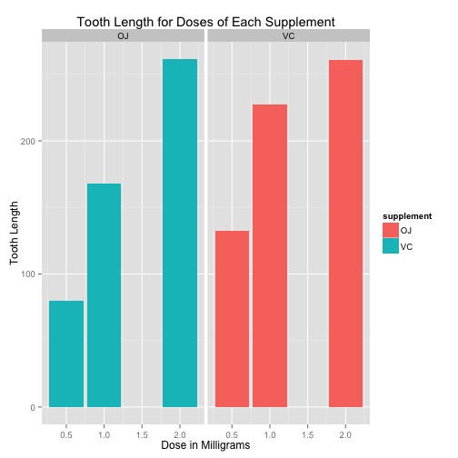

# Synopsis 
In this report we will be doing analysis on Tooth Growth Data. Using this data we will use confidence intervals and hypothesis testing in order to compare tooth growth by supplement type and dose. 

# Processing Data

### Setting Working Directory

```r
setwd("~/GitHub/Statistical-Inference-Course-Project")
```

### Opening Packages to Be Used

```r
library(ggplot2)
library(datasets)
library(gridExtra)
```

### Loading Data Set

```r
data("ToothGrowth")
```

### Heading Tooth Growth Data

```r
head(ToothGrowth)
```

```
##    len supp dose
## 1  4.2   VC  0.5
## 2 11.5   VC  0.5
## 3  7.3   VC  0.5
## 4  5.8   VC  0.5
## 5  6.4   VC  0.5
## 6 10.0   VC  0.5
```

### Summary Tooth Growth Data

```r
summary(ToothGrowth)
```

```
##       len        supp         dose      
##  Min.   : 4.20   OJ:30   Min.   :0.500  
##  1st Qu.:13.07   VC:30   1st Qu.:0.500  
##  Median :19.25           Median :1.000  
##  Mean   :18.81           Mean   :1.167  
##  3rd Qu.:25.27           3rd Qu.:2.000  
##  Max.   :33.90           Max.   :2.000
```


```r
summary(ToothGrowth$supp)
```

```
## OJ VC 
## 30 30
```

```r
summary(ToothGrowth$dose)
```

```
##    Min. 1st Qu.  Median    Mean 3rd Qu.    Max. 
##   0.500   0.500   1.000   1.167   2.000   2.000
```

### Assigning Variables

```r
dose          <-    ToothGrowth$dose
supplement    <-    ToothGrowth$supp
length        <-    ToothGrowth$len
```
# Summary

### Plotting The Data for ToothGrowth

```r
ggplot(ToothGrowth, aes(dose, length, fill=supplement)) + geom_histogram(stat="identity") +  facet_grid(. ~ supp) + labs(x = "Dose in Milligrams", y = "Tooth Length", title= "Tooth Length for Doses of Each Supplement")
```

 

### Hypothesis Test and Confidence Interval

#### Confidence Interval

```r
fit             <-  lm(length ~ dose + supplement, ToothGrowth)
confint(fit)
```

```
##                  2.5 %    97.5 %
## (Intercept)   6.704608 11.840392
## dose          8.007741 11.519402
## supplementVC -5.889905 -1.510095
```

#### T-Test Supplement

```r
t.test(length ~ supplement, ToothGrowth)
```

```
## 
## 	Welch Two Sample t-test
## 
## data:  length by supplement
## t = 1.9153, df = 55.309, p-value = 0.06063
## alternative hypothesis: true difference in means is not equal to 0
## 95 percent confidence interval:
##  -0.1710156  7.5710156
## sample estimates:
## mean in group OJ mean in group VC 
##         20.66333         16.96333
```

#### T-Test Doses

```r
ToothGrowth0.5 <- subset (ToothGrowth, dose %in% c(0.5, 1.0)) 
ToothGrowth1.0 <- subset (ToothGrowth, dose %in% c(0.5, 2.0)) 
ToothGrowth2.0 <- subset (ToothGrowth, dose %in% c(1.0, 2.0)) 
```
  
##### T-Test Dose=0.5

```r
t.test(len ~ dose, ToothGrowth0.5)
```

```
## 
## 	Welch Two Sample t-test
## 
## data:  len by dose
## t = -6.4766, df = 37.986, p-value = 1.268e-07
## alternative hypothesis: true difference in means is not equal to 0
## 95 percent confidence interval:
##  -11.983781  -6.276219
## sample estimates:
## mean in group 0.5   mean in group 1 
##            10.605            19.735
```
  
##### T-Test Dose=1.0

```r
t.test(len ~ dose, ToothGrowth1.0)
```

```
## 
## 	Welch Two Sample t-test
## 
## data:  len by dose
## t = -11.799, df = 36.883, p-value = 4.398e-14
## alternative hypothesis: true difference in means is not equal to 0
## 95 percent confidence interval:
##  -18.15617 -12.83383
## sample estimates:
## mean in group 0.5   mean in group 2 
##            10.605            26.100
```
  
##### T-Test Dose=2.0

```r
t.test(len ~ dose, ToothGrowth2.0)
```

```
## 
## 	Welch Two Sample t-test
## 
## data:  len by dose
## t = -4.9005, df = 37.101, p-value = 1.906e-05
## alternative hypothesis: true difference in means is not equal to 0
## 95 percent confidence interval:
##  -8.996481 -3.733519
## sample estimates:
## mean in group 1 mean in group 2 
##          19.735          26.100
```
  
# Conclusion

When we do the T-Test for the supplements, we see that the p-value is 0.0603 and the confidence interval contains a zero. Therefore, we cannot reject the null hypothesis, that the different supplement types have no effect on tooth length. This means that the different supplement types, Orange Juice and Vitamin C, have similar effect on tooth length. We also see from the graphs that different doses have different effects on tooth length. When we increase the doses of both Vitamin C and Orange Juice, we see an increase in tooth length on the test subjects. This conclusion is also show via the T-Tests done on each individual dose. The p-values are less than 0.05 and the confidence intervals do not contain 0. Therefore we can reject the null hypothesis and conclude that increasing the doses causes an increase in tooth length.
